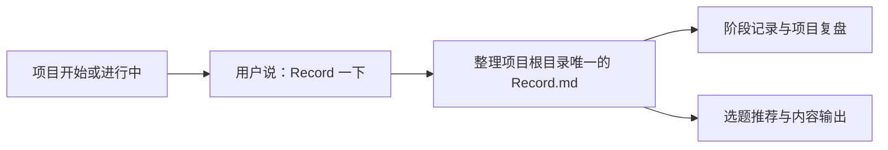
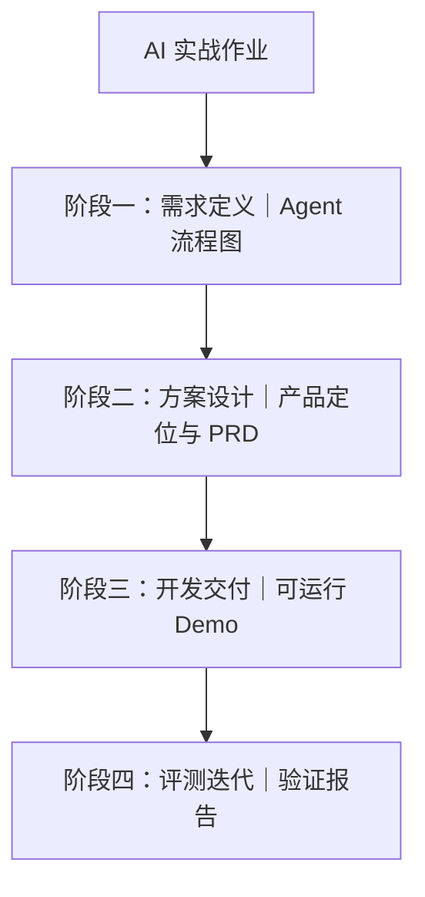

# Record skill

Record 是一个适用于 Codex、Claude Code、Hermes 及其他支持 Agent Skill 的 AI Agent 的项目记录 skill。它帮助你在项目开始前、进行中或结束后的任意节点，持续维护项目根目录下唯一的 `Record.md`。

它记录的不只是“做了什么”，还会保留项目中值得以后回看的内容：需要 AI 帮忙捋清的知识点、反复确认的问题、经常纠正 AI 的地方、反复调整和返工的原因，以及属于“我的闪光点”的学习突破、工作流搭建和创意成果。项目完成后，你可以根据这份记录复盘项目、介绍项目，或整理小红书图文选题和视频大纲。

下面这张图展示 Record 的基本使用关系：你在项目节点主动触发记录，AI 将内容整理进唯一的 `Record.md`，之后再从记录中进行复盘和选题输出。



## 它解决什么问题

很多项目在做完以后会遇到几个问题：

- 记得最后的结果，却忘了中间做过哪些关键判断；
- 想写项目复盘或发布一篇笔记，却不知道从哪里开始；
- 让 AI 总结时，得到的内容很完整，但缺少自己的表达和真实过程；
- 同类问题反复遇到，却没有留下以后可以复用的处理经验。

Record 的做法是：由你决定什么时候记录，AI 在你触发时回看已有内容，补充当前阶段的事实和有价值的事情，并把内容放回同一个 `Record.md` 中。这样记录会随着项目推进逐步形成，而不是等项目结束后一次性回忆。

## 核心定位

Record 不是普通的会议纪要，也不是自动判断项目是否结束的总结工具。

它更像是项目目录里的“长期记忆文件”：

- `README.md` 主要说明项目是什么、怎么使用；
- `Record.md` 主要记录项目实际经历了什么、哪些地方值得记住、以后可以怎么复用。

其中的“项目记录”部分可以直接作为项目描述和介绍使用，回答三个问题：

1. 为了解决什么问题？
2. 做了什么？
3. 结果如何？

## 什么值得记录

Record 优先记录下面三类内容。

### 1. 知识卡点

你原本无法解决，需要向 AI 求助、让 AI 帮忙捋清的知识点。

这类内容值得保留，因为它说明你曾经不熟悉什么，也能帮助你下次遇到相似问题时更快反应。

### 2. 高频问题

项目中被反复询问、反复确认，或者直接构成项目难点的问题。

重复出现通常说明这个问题很核心，或者你对它还没有形成稳定的判断方式。

### 3. AI 协作纠正与返工

你经常纠正 AI、反复调整要求、重新返工的内容，以及后来形成的更好描述方式或协作约定。

这类记录可以帮助你总结：以后怎样表达更清楚，哪些边界需要提前说，哪些错误方向应该尽早阻止。

### 4. 我的闪光点

记录这个阶段里最有成就感、最让你骄傲，或最能体现个人能力的事情，例如：

- 学会了一个原本不熟悉的知识或工具；
- 搭建出一套可以重复使用的工作流；
- 提出了别出心裁、解决关键问题的创意；
- 在困难、返工或不确定中做出了重要突破。

这部分不要求每个阶段都必须有内容，但一旦出现，就应该单独留下，方便以后回看自己的成长和项目亮点。

普通进展仍然可以放在“事实记录”里。不要为了填满模板，把所有对话都写进“有价值的事情”。记录应该留下具体、真实、以后能用上的内容。

## 适用场景

### 项目开始前

你可以先在项目根目录建立 `Record.md`，写下项目名称、开始日期和预计阶段。也可以直接告诉正在使用的 AI Agent：

```text
这个项目我会使用 Record，请先建立项目阶段总览。
```

此时可以先搭好阶段框架，不需要一次写完全部内容。

### 项目进行中

当一个阶段完成、方向发生变化、一个难点被解决，或者一轮返工结束时，可以主动说：

```text
Record 一下，把 2026-09-14 这一阶段整理进去。
```

AI 会读取已有的 `Record.md`，整理本次新增事实，判断哪些内容属于三类有价值信息，并补充当前阶段的选题推荐。

### 项目结束后或准备发布前

项目是否结束由你决定。你不需要等到项目结束后才能使用 Record，也不需要让 AI 自己判断项目是否结束。

准备复盘或发布时，可以说：

```text
根据 Record.md 给我做小红书图文选题。
```

或指定范围：

```text
根据 Record.md，重点围绕我反复纠正 AI 的部分推荐选题。
```

## 安装

Record 是一个通用的 Agent Skill。使用前需要把本仓库放到你正在使用的 AI Agent 的 skills 目录中。

### 方式一：使用 Git 克隆

在终端运行：

```powershell
git clone https://github.com/Xarles-Lovell/Record-skill.git
```

然后把得到的 `Record-skill` 文件夹放入对应 AI Agent 的 skills 目录，并将文件夹名改成 `Record`（如果你的环境要求 skill 文件夹名与 `name` 一致）。目录结构应类似：

```text
skills/
└── Record/
    ├── SKILL.md
    ├── README.md
    ├── evals.json
    └── templates/
        └── Record.md
```

不同 AI Agent 的 skills 目录位置和加载方式可能不同。如果你不确定目录在哪里，请查看对应 Agent 的 skill 安装说明，找到已有 skill 所在的目录，再把 `Record` 放在同一级。

### 方式二：下载 ZIP

1. 打开 [Record-skill GitHub 仓库](https://github.com/Xarles-Lovell/Record-skill)。
2. 点击 `Code`，再点击 `Download ZIP`。
3. 解压后，将 `Record-skill` 文件夹放到对应 AI Agent 的 skills 目录。
4. 按上面的目录结构确认 `SKILL.md` 位于 skill 文件夹的第一层。

## 第一次使用

实际项目中，`Record.md` 应该放在项目根目录，和项目自己的 `README.md` 处于同一级。

你可以复制本仓库的模板：

```text
Record-skill/templates/Record.md
```

复制后，将它放到项目根目录并命名为：

```text
Record.md
```

如果项目根目录已经存在 `Record.md`，直接让 AI 读取和整理，不要再创建第二份。

注意：本仓库里的 `templates/Record.md` 是模板，不是某个具体项目的记录。每个项目只维护一份自己的根目录 `Record.md`。

## 触发方式

下面这些说法会触发记录整理：

| 目的 | 可以怎么说 | 预期行为 |
| --- | --- | --- |
| 记录当前阶段 | `Record 一下` | 读取旧记录，补充当前阶段内容 |
| 整理记录 | `整理记录一下` | 回看已有内容，合并重复信息并补充遗漏 |
| 明确使用 skill | `使用 Record skill` | 按 Record 规则处理当前请求 |
| 记录一轮工作 | `记录一下 2026-09-14 做的内容` | 将当前对话中的事实和价值信息写入对应阶段 |
| 检查旧记录 | `Record 里这段好像不对` | 先指出可能有问题的内容并询问是否修改 |
| 生成选题 | `根据 Record.md 做选题` | 按用户指定的范围输出选题 |

“记录”出现在普通描述里时，不一定代表要更新文件。为了避免误触发，最好使用上面的明确说法，或者直接说明“请更新项目根目录的 `Record.md`”。

## 一次记录会做什么

触发后，AI 会按这个顺序处理：

1. 查找项目根目录的 `Record.md`。
2. 读取已有阶段、日期、事实、价值记录和选题。
3. 根据当前对话或项目文件提取本次新增内容。
4. 将内容归入正确的项目阶段。
5. 补充知识卡点、高频问题、AI 协作纠正与返工记录。
6. 记录当前阶段的“我的闪光点”。
7. 为当前阶段生成 3 至 5 个简短选题。
8. 更新整个项目总结和选题汇总中受影响的部分。
9. 检查是否误造日期、结果、指标或用户观点。

AI 不会因为看到最后一次对话就把项目标记为结束，也不会在没有触发时擅自修改 `Record.md`。

## `Record.md` 的固定结构

完整记录按下面的顺序组织：

```text
项目名称
  ↓
项目阶段总览
  ↓
阶段一、阶段二、阶段三……
  - 阶段日期
  - 事实记录
  - 有价值的事情
  - 阶段选题推荐
  ↓
整个项目总结
  - 项目记录
  - 最核心的有价值事情
  - 全项目选题推荐
  ↓
选题推荐汇总
  - 用户指定的选题
  - 整个项目选题
  - 各阶段 AI 推荐
```

### 项目阶段总览

记录项目开始日期、用户明确说明的结束日期，以及项目阶段图。

如果用户没有说明结束日期，写“未说明”；不要把最后一次对话日期当成结束日期。

### 各阶段记录

每个阶段都包含：

- **阶段日期**：使用可以确认的实际日期；
- **事实记录**：简要写清做了什么、产出了什么、遇到了什么变化；
- **有价值的事情**：按知识卡点、高频问题、AI 协作纠正与返工、我的闪光点分类；
- **阶段选题推荐**：只写 3 至 5 个选题标题。

### 整个项目总结

#### 项目记录

“项目记录”是项目描述和介绍部分，不是单纯的结果罗列。它应该完整说明：

- 为了解决什么问题；
- 做了什么；
- 结果如何。

这部分可以用于项目复盘，也可以作为项目介绍的基础内容直接复制后修改。

#### 最核心的有价值事情

从所有阶段中挑出最值得记住、最能代表项目经验的内容，不需要把每条阶段记录原样重复一遍。

其中单独提炼“最重要的闪光点”，突出最能代表个人成长、能力突破或创意贡献的内容。

#### 全项目选题推荐

从整个项目角度推荐选题，适合做项目复盘、过程分享或经验总结。

### 选题推荐汇总

文末统一收纳三类选题：

1. 用户明确指定的选题，放在最前面；
2. 整个项目的选题；
3. 各阶段的 AI 推荐。

## 阶段选题规则

每个阶段默认推荐 3 至 5 个选题，只写标题，不在 `Record.md` 中展开正文。

选题范围遵守时间顺序：

- 当前阶段的选题以当前阶段内容为主；
- 可以少量结合此前已经完成的阶段；
- 不引用未来阶段的内容；
- 当前阶段相关选题数量应多于跨阶段选题数量。

例如，第二阶段推荐 3 个选题时，可以是“1 个阶段一与阶段二结合的选题 + 2 个阶段二选题”；推荐 5 个时，可以是“2 个跨阶段选题 + 3 个阶段二选题”。

如果你指定了某一件或某几件有价值的事情做选题，AI 除了完成当前输出，还会把它放入文末“用户指定的选题”区域的最前面。

## 根据 Record 输出内容

### 只要选题

你可以说：

```text
根据 Record.md 做选题，只给我标题。
```

默认按“用户指定的选题、整个项目选题、各阶段选题”分组，不自动写正文。

### 小红书图文

你可以说：

```text
根据 Record.md，给我做小红书图文选题，先只推荐选题。
```

选定题目后，再说：

```text
把第 2 个选题扩写成小红书图文草稿，保留我的原话和真实返工过程。
```

输出应尽量保留具体过程、实际判断和真实结果，避免写成没有个人经历的通用鸡汤。

### 视频大纲

你可以说：

```text
根据 Record.md，把这个项目整理成一个视频大纲。
```

视频大纲默认包含：标题、开头钩子、内容段落和结尾行动。除非 Record 中有依据，不虚构镜头、数据、经历或结果。

如果你没有指定形式，默认先偏向小红书图文选题，因为图文更适合快速整理和记忆。

## Mermaid 阶段图

Record 默认使用 Mermaid 的 `flowchart TB` 绘制项目阶段图。阶段图不是完整流程文档，只需要让人快速看懂项目从哪里开始、经过哪些阶段、每个阶段完成了什么。

建议每个阶段节点包含：

- 阶段名称；
- 阶段成果；
- 关键步骤或关键价值点的简短说明。

示例：

````markdown

````

包含 Mermaid 的 `Record.md` 在支持 Mermaid 的 Markdown 工具中可以直接预览：

- **Obsidian**：打开本地 Markdown 文件即可直接查看；
- **ima**：打开 Markdown 文件时可以直接看到 Mermaid 图；
- **Notion**：支持显示 Mermaid，但内容需要放在 Notion 中，不像本地文件那样方便；

也可以使用下面的网页工具查看、修改和导出：

- [Mermaid Live Editor](https://mermaid-live.nodejs.cn/)：功能完整，适合编辑和导出；
- [jyshare Mermaid 工具](https://www.jyshare.com/front-end/9729/)：主题切换更直接，适合快速查看。

如果你不想使用 Mermaid，可以直接说“这次用纯文字，不要 Mermaid”，AI 会改用文字描述。

## 日期、事实与修正规则

### 日期不确定时

只使用用户明确说过的日期，或项目文件中可以核实的日期。

无法确认时写：

```text
实际日期待补充；本次整理日期：YYYY-MM-DD
```

不会根据上下文猜测日期，也不会把最后一次对话日期自动当作项目结束日期。

### 发现旧记录可能有误时

AI 会先指出具体内容，例如：

```text
我发现“阶段二结果”与当前项目文件中的结果不一致，可能需要修改。
准备修改为：[修改后的内容]
是否确认修改？
```

在你确认前，AI 不会直接改动这条事实。你确认后，AI 可以直接修改原文；除非你另有要求，不额外添加修订日志。

### 信息来源

记录内容必须来自：

- 当前对话；
- 项目文件；
- 用户明确提供的信息。

AI 不会自行补写没有依据的指标、结果、责任边界或用户观点。

## 常见问题

### Record 和 README 有什么区别？

`README.md` 说明项目是什么、如何运行或使用；`Record.md` 记录项目实际经历、关键判断、问题和经验。两者都可以放在项目根目录，但用途不同。

### Record 和普通项目日志有什么区别？

普通日志通常按时间记录发生了什么。Record 在阶段事实之外，还专门整理知识卡点、高频问题、AI 协作纠正、返工原因、个人闪光点和内容选题，因此更适合项目复盘和经验复用。

### 项目还没结束，可以使用吗？

可以。Record 的设计就是在项目进行中由你主动打阶段标记。项目是否结束由你决定，AI 不会替你判断。

### 可以把多个项目写进一个 `Record.md` 吗？

不建议。默认一个项目对应一份根目录 `Record.md`。如果多个项目共用一个父目录，请为每个项目分别维护自己的根目录记录文件。

### 可以不用 Mermaid 吗？

可以。直接要求使用纯文字即可。默认使用 Mermaid 是为了方便在 Obsidian、ima 等支持 Mermaid 的 Markdown 工具中快速查看阶段关系。Notion 也可以显示 Mermaid，但它依赖在线工作区，管理本地记录时不如本地工具方便。

### 日期不知道怎么办？

写“实际日期待补充”，同时记录本次整理日期。不要猜测真实日期。

### 可以让 AI 自动判断项目结束吗？

Record 默认不会这样做。项目结束和阶段边界由用户决定，这样可以避免 AI 把一次普通对话误判成项目结束。

### 可以直接生成完整小红书笔记吗？

可以，但建议先让 AI 推荐选题，再指定一个选题扩写。这样更容易保留你的真实经历，也方便你筛掉不想公开的内容。

## 限制与注意事项

- Record 无法恢复没有出现在当前对话或项目文件中的事实；
- `Record.md` 越具体，后续复盘和选题越有用；
- 对外发布前，请检查隐私、未公开信息、合作方信息和表述准确性；
- 不要在项目子文件夹随意创建第二个 `Record.md`，除非你明确要求；
- 选题是基于已有记录的整理和提炼，不代表 AI 自动验证了项目结果；
- 用户指定的修改、阶段名称和结束日期优先于 AI 的推断。

## 仓库文件说明

```text
Record-skill/
├── SKILL.md              # AI Agent 实际读取的 skill 规则
├── README.md             # 面向公开使用者的说明文档
├── evals.json            # 基础测试提示
└── templates/
    └── Record.md         # 项目根目录记录文件模板
```

其中：

- `SKILL.md` 决定触发条件、记录逻辑和输出规则；
- `README.md` 帮助公开用户理解和使用；
- `templates/Record.md` 只用于复制到具体项目根目录；
- `evals.json` 用于后续测试 skill 是否按预期工作。

## 反馈与贡献

如果你发现 Record 在某种说法下没有正确触发，或输出格式不符合预期，可以在 GitHub 仓库提交 Issue。

反馈时最好提供：

1. 你输入的原话；
2. 当时项目根目录的 `Record.md` 结构；
3. 实际输出和你期望的输出；
4. 是否涉及日期、阶段、修正确认或选题规则。

如果修改了 `SKILL.md` 的行为规则，也请同步检查 `README.md`、`templates/Record.md` 和 `evals.json`，避免说明、模板和实际行为不一致。

## 许可证

当前仓库尚未指定许可证。若要在其他项目中分发或二次修改，请先确认仓库所有者的授权范围。

## 开发者日志

这里记录 `Record-skill` 本身的开发过程，和使用 Record skill 时生成的项目记录不是同一个栏目。

### 2026-09-12：确定核心结构并创建仓库

- 明确 Record 的定位：由用户主动触发，在项目根目录维护唯一的 `Record.md`。
- 确定记录结构：项目阶段总览、阶段事实记录、三类有价值的事情、项目记录、阶段选题和选题汇总。
- 加入 Mermaid 阶段图、日期不猜、事实修正先询问等规则。
- 创建 `Record-skill` GitHub 仓库并发布初版。

### 2026-09-13：面向公开用户扩充 README

- 将 README 从个人使用说明扩展为公开使用指南。
- 补充安装方式、触发示例、`Record.md` 格式、选题输出、Mermaid 工具和常见问题。
- 明确适用于 Codex、Claude Code、Hermes 及其他支持 Agent Skill 的 AI Agent。

### 2026-09-14：补充 Mermaid 图示与个人闪光点

- 在 README 开头加入 Record 使用流程 Mermaid 图，帮助读者先理解整体关系。
- 增加“我的闪光点”作为独立的有价值内容类别，用于记录学习突破、工作流搭建、创意和成就感来源。
- 将本项目开发过程和 Record skill 的使用规则分开说明，避免概念混淆。
