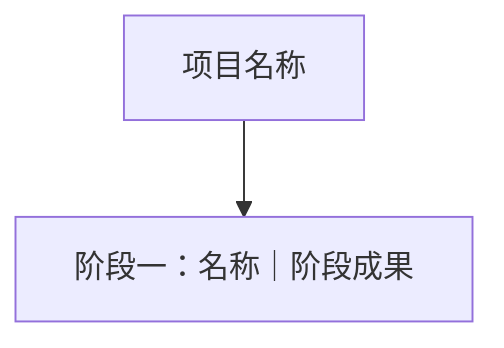

# [项目名称]

## 项目阶段总览
- 开始日期：[YYYY-MM-DD 或待补充]
- 结束日期：[用户说明的日期 / 未说明]

## 阶段一：[名称]｜[日期]
### 事实记录
- 暂无

### 有价值的事情
#### 知识卡点
- 暂无
#### 高频问题
- 暂无
#### AI 协作纠正与返工
- 暂无

### 阶段选题推荐
- [ ] 选题一
- [ ] 选题二
- [ ] 选题三

## 整个项目总结
### 项目记录
> 本部分作为项目描述和介绍使用，完整说明项目为什么做、做了什么、结果如何。
- 为了解决什么问题：
- 做了什么：
- 结果如何：

### 最核心的有价值事情
- 暂无

### 全项目选题推荐
- 暂无

## 选题推荐汇总
### 用户指定的选题
- [ ] 暂无
### 整个项目选题
- [ ] 暂无
### 各阶段 AI 推荐
- [ ] 暂无
